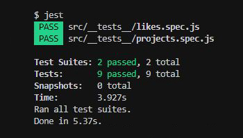

<h1 align="center">
  🚀 Conceitos de NodeJS 🚀
</h1>

<h3 align="center">
Desafio aplicado no Bootcamp GoStack da Rocketseat
</h3>

---

## Índice

- [Sobre](#-sobre)
- [Tecnologia utilizada](#-tecnologia-utilizada)
- [Objetivos](#-objetivos)
- [Testes de Validação](#-testes-de-validação)
- [Para clonar e executar o projeto](#-para-clonar-e-executar-o-projeto)
- [Para executar os testes](#-para-executar-os-teste)


---

## 🔖 Sobre

Primeiro desafio proposto pela Rocketseat relacionado à conceitos do Node.js. O intuito final da aplicação (resultante de mais desafios) é armazenar repositórios do seu portfólio, que irá permitir a criação, listagem, atualização e remoção dos repositórios, e além disso permitir que os repositórios possam receber "likes".

---

## 🚀 Tecnologia utilizada

- [NodeJS](https://nodejs.org/en/)

---

## 🎯 Objetivos

Este desafio consistiu em criar o **back-end** da aplicação que permitem retornar de forma correta as requisições feitas pelo cliente. Para isso foram utilizados os principais métodos HTTP: ***GET***, ***POST***, ***PUT*** e ***DELETE***.

---

## 📝 Testes de Validação



Para que o desafio seja válido, a aplicação teve que passar por nove testes, que são eles:

- **Seja possível criar um novo repositório:**
Para passar neste teste, a aplicação deve permitir que um repositório seja criado, e retorne um json com o projeto criado.

- **Seja possível listar repositórios existentes:**
Para passar neste teste, a aplicação deve permitir que seja retornado um array com todos os repositórios que foram criados até o momento.

- **Seja possível atualizar um repositório:**
Para passar neste teste, a aplicação deve permitir que sejam alterados apenas os campos url, title e techs.

- **Que NÃO seja possível atualizar repositórios que NÃO existam:**
Para passar neste teste, a aplicação deve validar na rota de update se o id do repositório enviado pela url existe ou não. Caso não exista, retornar um erro com status 400.

- **Que NÃO seja possível atualizar "likes" de um repositório manualmente:**
Para passar neste teste, não pode ser permitido que a rota de update altere diretamente os likes desse repositório, mantendo o mesmo número de likes que o repositório já possuia antes da atualização. Isso porque o único lugar que deve atualizar essa informação é a rota de responsável por aumentar o número de likes.

- **Seja possível deletar um repositório:**
Para passar neste teste, deve ser permitido que a rota de delete exclua um projeto, e ao fazer a exclusão, ele retorne uma resposta vazia, com status 204.

- **Que NÃO seja possível deletar repositórios que NÃO existam:**
Para passar neste teste, a aplicação deve validar na rota de delete se o id do repositório enviado pela url existe ou não. Caso não exista, retornar um erro com status 400.

- **Seja possível dar um "like" para o repositório:**
Para passar neste teste, a aplicação deve permitir que um repositório com o id informado possa receber likes. O valor de likes deve ser incrementado em 1 a cada requisição, e como resultado, retornar um json contendo o repositório com o número de likes atualizado.

- **Que Não seja possível dar "like" em respositórios que não existam:**
Para passar neste teste, a aplicação deve validar na rota de like se o id do repositório enviado pela url existe ou não. Caso não exista, retornar um erro com status 400.

---

## ⚙ Para clonar e executar o projeto

```bash
  # clonar o projeto
  $ git clone https://github.com/DigooDS/conceitos-nodejs.git

  # acessar o projeto
  $ cd conceitos-nodejs

  # executar o projeto
  $ yarn dev
```

---

## 🛠 Para executar os testes

```bash
  $ yarn test
```

---

<i>Desenvolvido por RodrigoDS</i> 🤓
